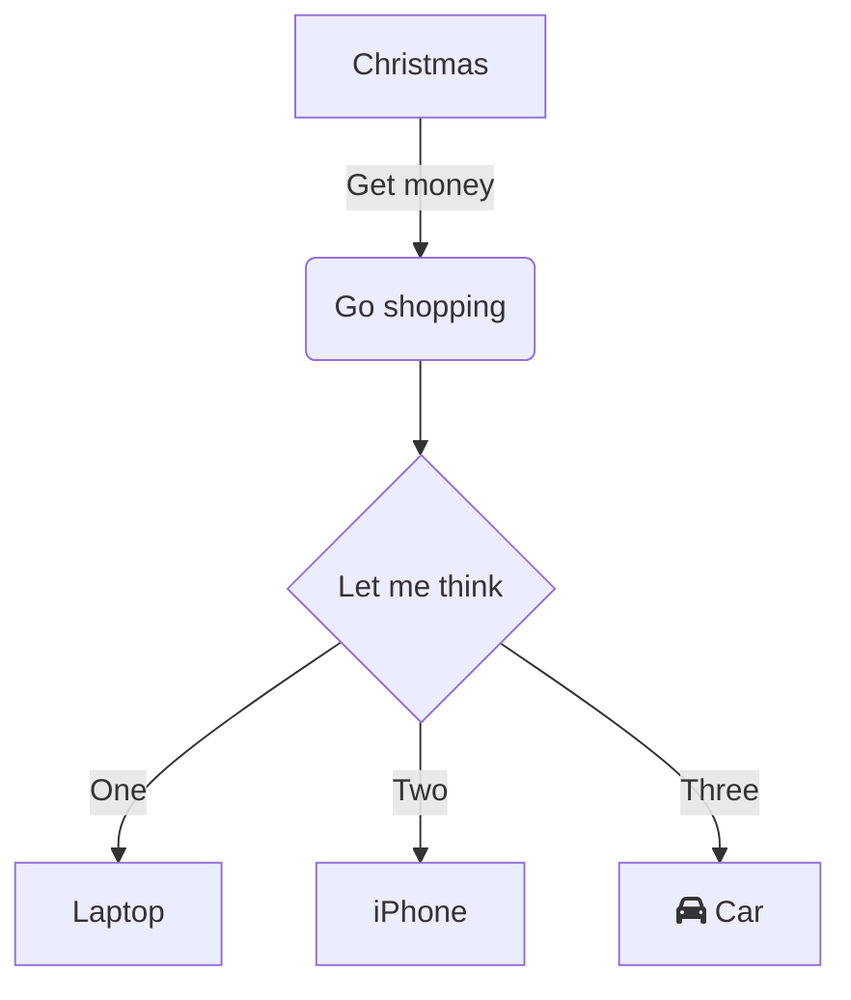

# Studio operations manual

This manual is intended as a practical reference to manage Interrobang Studio,
a small in-house setup for creating music, audio design, and multimedia
performances. It will be versioned to track the studio's evolution over time,
and as an aid in reproducing older work if needed. 

We should also be able to generate printed output, a 3-ring binder (or
equivalent) with quick reference information and on-demand troubleshooting
guides. This should help to right the ship even in high-pressure situations,
e.g. live performance or studio collaboration with others.

I'm planning to build this in Markdown for future compatibility and
auto-rendering on Github. This can probably be fed to pandoc or other systems
to build printed output, HTML pages, etc.

Manual contents include:

  - overview documents like this README
    - guiding principles and rules of thumb
    - how to retrieve versions, update/destroy old printed output
  - an "atlas" of all controllers, MIDI resources, apps, etc.
    - embedded/versioned files for configuration
    - embedded template files (esp for Logic Pro)
  - network diagrams for hardware, protocols, servers and hubs
    - clarify rules for traditional MIDI, MIDI-over-USB, etc.
      ? how to MIDI devices and ports work over USB?
    - TRY [text-based diagrams with Mermaid][mermaid]
  - links to supporting standards and conventions, e.g. MIDI
  - contact information for vendor support
      - NOT warranty and licenses info, which are best kept private
  - visual (or tabular) maps for hardware controllers, drumpads etc.
  - case studies(?) for specific projects w/ unusual setup
      - packing/setup checklists for rehearsal and stage
  - troubleshooting and emergency procedures (ideally on paper)

How hard is it to include text-based diagrams? 

    
https://en.wikipedia.org/wiki/Operations_manual
https://en.wikipedia.org/wiki/General_MIDI#Percussion
https://en.wikipedia.org/wiki/General_MIDI#Controller_events
https://www.midi.org/specifications/midi1-specifications/general-midi-specifications/general-midi-1/general-midi-level-1-2
https://en.wikipedia.org/wiki/General_MIDI_Level_2#Supported_Control_Change_messages

This work is [licensed](LICENSE) under a
[Creative Commons Attribution 4.0 International License][cc-by].

[![CC BY 4.0][cc-by-image]][cc-by]

[cc-by]: http://creativecommons.org/licenses/by/4.0/
[cc-by-image]: https://i.creativecommons.org/l/by/4.0/88x31.png
[mermaid]: https://docs.github.com/en/get-started/writing-on-github/working-with-advanced-formatting/creating-diagrams
